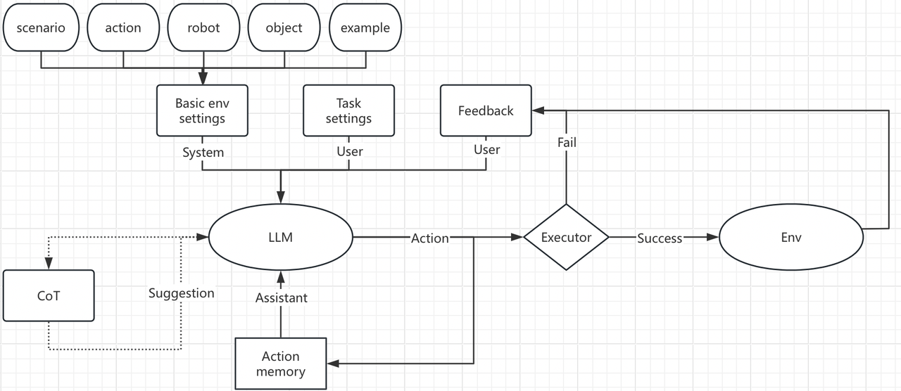

# LLMTaskPlanner

**A lightweight framework for evaluating the planning capabilities of Large Language Models (LLMs).** LLMTaskPlanner provides an efficient environment for testing complex reasoning, multi-agent collaboration, and task execution. With support for diverse actions, environments, and capability settings, it offers comprehensive feedback and multiple difficulty levels. Designed for easy setup and extensibility, LLMTaskPlanner is ideal for researchers and developers seeking to benchmark LLMs efficiently and effectively.

## Directory Structure
```text
.
|-- README.md
|-- bin/
|-- conf/
|-- dataset
|   |-- sllm
|   |   |-- resource/
|   |   |-- script/
|   |   `-- test/
|   `-- tdw/
|-- requirements.txt
`-- src
    |-- basic_planner.py
    |-- evaluate.py
    |-- misc/
    |-- sllm/
    `-- tdw/
```

## Feature Overview (Sllm)

1. **13 Supported Actions**:
    - GoTo, PickUp, Put, Open, Close, ToggleOn, ToggleOff, Break, Slice, Clean, Dirty, FillWithLiquid, EmptyLiquid

2. **Three-Dimensional Capability Settings**:
    - **Capacity (Number)**: Maximum number of items that can be held simultaneously
    - **Capacity (Mass)**: Maximum load capacity
    - **Skill Set**: Allowed actions that can be executed

3. **Single-Agent and Multi-Agent Settings**:
    - **Single-Agent**: Evaluates basic reasoning performance
    - **Multi-Agent**: Evaluates understanding of cooperation and scheduling.
        - Each robot may have different capabilities
        - Cooperation is not just for efficiency; some tasks can only be completed through multi-agent collaboration

4. **Rich Environments**:
    - Based on the iTHOR environment from AI2-THOR version 5.0, covering various scenes such as living rooms, bedrooms, kitchens, and bathrooms

5. **Comprehensive Feedback Mechanism**:
    - Provides detailed feedback based on execution status

6. **Three Difficulty Levels**:
    - **Easy**: Assesses basic performance and understanding of individual actions
    - **Moderate**: Similar in difficulty to other standard benchmarks, such as SmartLLM, assessing the comprehensive use of actions
    - **Hard**: Significantly more challenging than standard benchmarks, assessing long-term planning (approximately 15 actions) and understanding of ambiguous semantics

7. **Five Task Types**:
    - **Straightforward**: Can be completed directly with minimal or no reasoning required.
    - **Troublesome**: Involves complex reasoning, though the correct course of action is clear.
    - **Ambiguous**: Demands complex reasoning with an uncertain or unclear path to the correct solution.
    - **Teasing**: The task might already be in the correct state naturally, challenging the model to recognize and understand initial conditions.
    - **Destructive**: Requires actions that involve breaking or damaging objects, testing the model's ability to handle scenarios that involve irreversible changes.

8. **Five Task Configurations**:
    - **Omnipotent**: No restrictions, single-agent, assesses basic logical reasoning
    - **Capacity Limited**: Restrictions on capacity (number and mass), single-agent, assesses understanding of load
    - **Skills Limited**: Restricted skill set, providing only the necessary skills, multi-agent, assesses understanding of cooperation
    - **Skills Limited Disruptive**: Restricted skill set with unnecessary disruptive skills, multi-agent, assesses cooperation in real-world scenarios
    - **Comprehensive**: Combines capacity limited and skills limited disruptive settings, multi-agent, assesses comprehensive understanding

9. **12 Metrics**:
    - **3 Metrics for Evaluating Reasoning Performance**: SER (Success Execution Rate), GCR (Goal Completion Rate), SR (Overall Success Rate). Suitable for hierarchical evaluation of models of different levels.
    - **2 Metrics for Evaluating Reasoning Efficiency**: TC (Time Consumption for each action), PL (Path Length, with each action having a length of 1). These can be used to evaluate task completion efficiency when reasoning performance is comparable. Reducing errors, maximizing the use of 3 skills, and cooperation can improve these metrics.
    - **3 Metrics for Evaluating Resource Consumption**: CTC (Completion Token Count), PTC (Prompt Token Count), TTC (Total Token Count). Some methods may enhance reasoning capabilities but increase resource consumption, which might require trade-offs.
    - **4 Metrics for Evaluating Response Latency**: TTFT (Time to First Token), Latency (Total Latency), TPOT (Time Per Output Token), TPS (Tokens Per Second). These are used to evaluate the speed of the underlying LLM/processor.

10. **Generation Methods**:
      - Compatible with both score-based and generate-based approaches, allowing for comparisons between them

11. **Simulator Settings**:
    - Abstracting Common Simulation Engines with State Machines:
        - Rationale: To focus the tasks on the planning aspect when evaluating LLM planning abilities, the parts beyond the planning (like the next-level executor) need to be abstracted. Common benchmark methods execute these steps with algorithms on the simulator, achieving close to 100% success rate (assuming the planning actions are correct). However, there are issues:
            1. Due to the complexity and disorderliness of underlying actions, it often fails to achieve a 100% success rate, confusing the planning process.
            2. Since it’s not detached from the simulator, setting up the environment on a server is quite challenging, and the runtime speed is extremely slow.
            3. The resource consumption for this kind of benchmark is entirely unnecessary for evaluating planning abilities.
        - Advantages: By abstracting the common simulation engines using state machines, these issues can be effectively avoided:
            - The underlying execution can achieve 100% accuracy
            - Feedback can be rich and precise
            - Highly extensible, allowing easy adjustments to various settings for diverse model evaluations
            - Fast execution speed, light weighted, with easy environment setup
            - While some benchmarks claim that "less than 100% success rate in underlying execution when planning actions are correct is also part of real-world scenario simulation," I have reservations. After all, this shouldn’t be the focus of such a benchmark (which doesn’t accept visual input and focuses on planning). However, if needed, given the high extensibility of this benchmark, it is entirely possible to introduce such a setting, for example, "random failure" during execution, and transmit the feedback to the LLM for replanning.

## Sllm Setup Guide

1. run `pip install -r requirements.txt`
2. Download LLM model from huggingface
3. run `bash bin/start_vllm.sh $port $gpu-memory-utilization` to start local vllm server. For more about openai_compatible_server, please refer to [openai_compatible_server](https://docs.vllm.ai/en/latest/serving/openai_compatible_server.html)
4. run `python -u src/evaluate.py --config-name=config_sllm planner.model_name=$model_name planner.port=$port task_category=capacity_limited` to start evaluation. For more auguments, please refer to `conf/config_sllm.yaml` and `conf/planner/sllm.yaml`

## Sllm Workflow



## TDW Setup Guide

1. Follow the [Xorg Configuration](https://github.com/threedworld-mit/tdw/blob/master/Documentation/lessons/setup/server.md#install-xorg) to set up Xorg. This step requires sudo privileges.
2. Install TDW by following the [TDW Installation Guide](https://github.com/threedworld-mit/tdw/blob/master/Documentation/lessons/setup/server.md#install-tdw). The tested TDW version is `1.11.23`. After installation, perform a heartbeat test to ensure proper setup.
3. Navigate to the directory `backup/Co-LLM-Agents/tdw_mat` and run `pip install -e .` to install the necessary packages.
4. Run the test script using `python demo/demo_scene.py`. Note that the reset step may take a significant amount of time (approximately 2 minutes), which is normal.
5. Installing the detection module is currently optional. If needed, refer to the [Detection Module Installation Guide](https://mmdetection.readthedocs.io/en/latest/get_started.html) and download the [pretrained models](https://github.com/UMass-Foundation-Model/Co-LLM-Agents/tree/master/tdw_mat#detection-model). Be aware that this process may encounter several bugs. If necessary, install from the source and make appropriate modifications to the source code.
6. For task details, refer to the [TDW-MAT Tasks](https://github.com/UMass-Foundation-Model/Co-LLM-Agents/tree/master/tdw_mat#tasks).
7. Although you can specify the port when starting the TDW Server with `DISPLAY=:1 ./TDW.x86_64 -port 1071`, testing has shown that the server still occupies the default port 1071, making it impossible to run multiple TDW servers concurrently.
8. Testing environment: cuda-11.7, python 3.9.19, torch 2.1.2+cu118, tdw 1.11.23.5, vllm 0.4.0+cu118, openai 1.35.10

## TDW Evaluation Guide

1. Ensure that the TDW Server is located in the home directory, with the path `~/TDW/TDW.x86_64`. If this path is not valid, you can manually change it in `tdw_env.might_fail_launch`.
2. Run the test script using `./bin/test_tdw.sh`. Before running, please review the script content.
3. The dataset is located in `dataset/tdw`. You can choose to test either the test dataset or the training dataset by configuring the `data_prefix` in the configuration file.
4. The evaluation script can automatically start or stop the TDW Server, but it will not start the vllm Server.
5. Since the environment has not been further abstracted, the evaluation process can be quite time-consuming. To reduce runtime, you may consider modifying the `eval_episodes` in the configuration file to an array corresponding to task indices in `data_prefix/data_path`. When `eval_episodes` is set to -1, all tasks will be evaluated.

## Reference

[LoTa-Bench](https://github.com/lbaa2022/LLMTaskPlanning)

[TDW](https://github.com/threedworld-mit/tdw)
